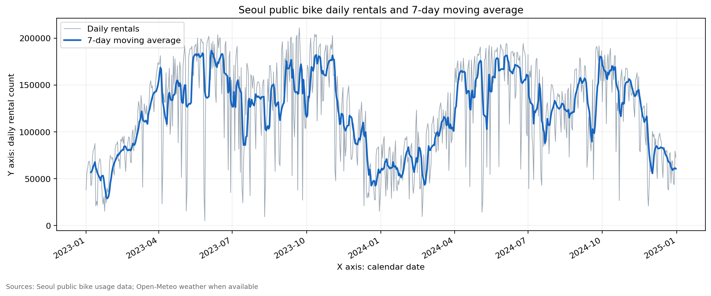
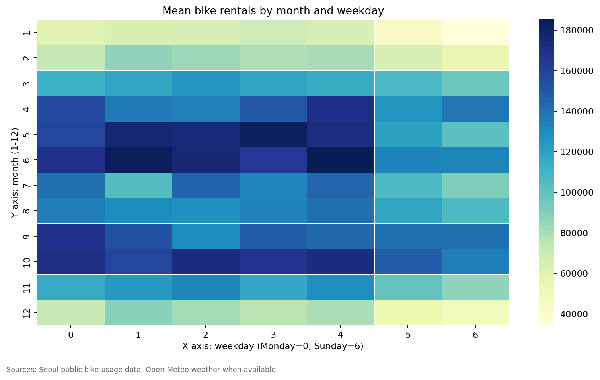
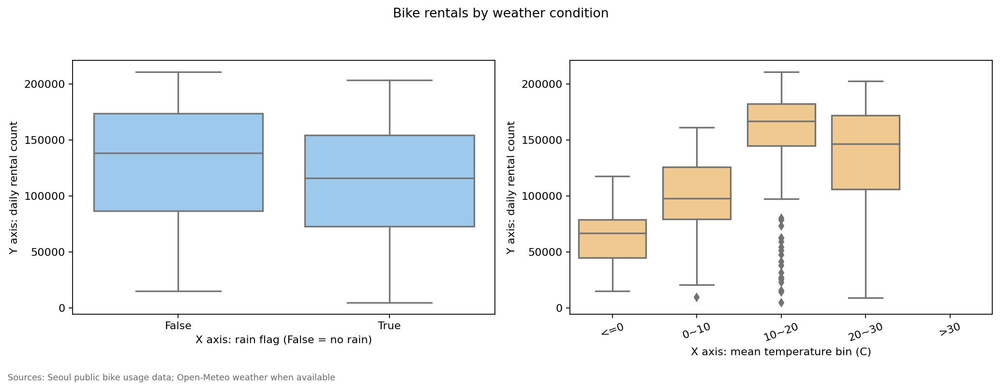
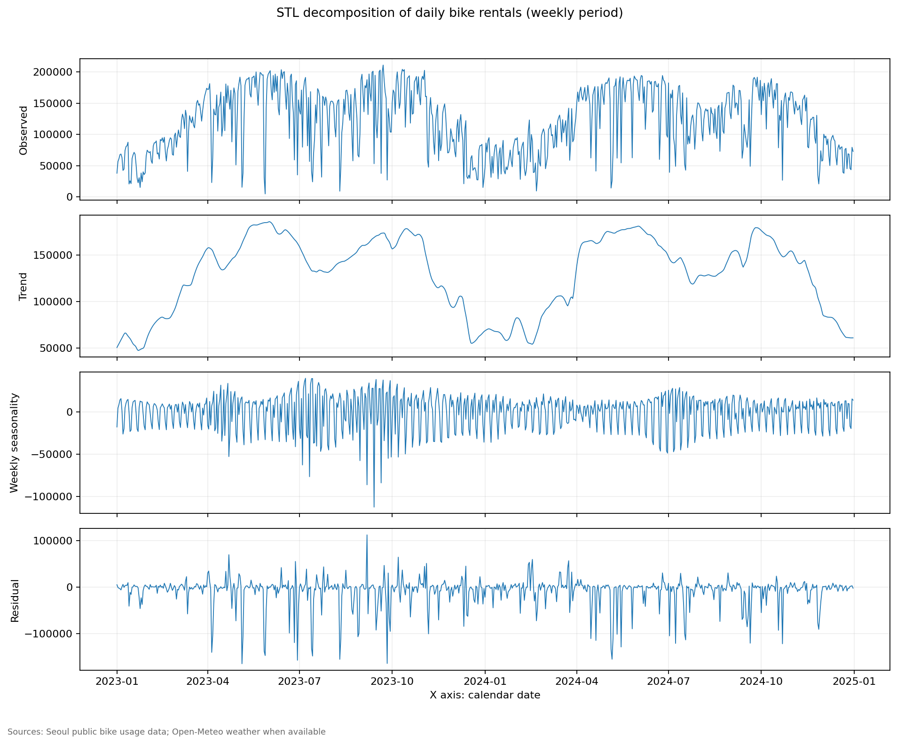
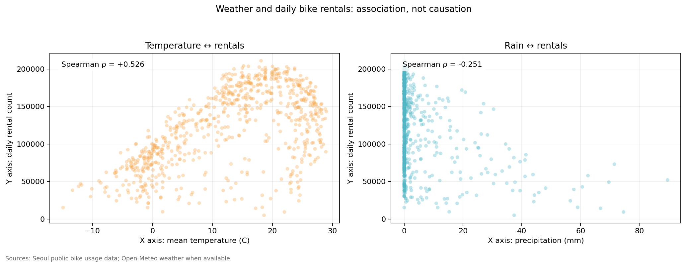
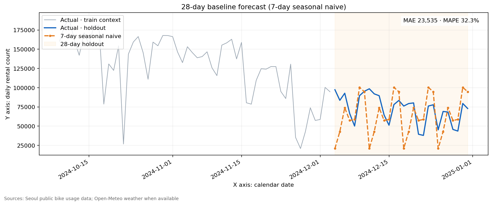

# 2023~2024년 서울시 따릉이 일별 이용량 시계열 분석

## 1. 분석 주제 및 선정 이유

서울시 전체 따릉이 일별 이용량에서 장기 추세, 월·요일 계절성, 기상 조건별 차이, 급격한 변화 구간을 확인한다. 자전거 이용은 계절·요일·강수의 영향을 함께 받을 가능성이 있으므로, 단순히 그래프를 그리는 데서 끝내지 않고 관찰된 수치와 가능한 해석을 구분해 기록했다.

## 2. 분석 질문

1. 2023~2024년 이용량에 장기적인 추세와 계절성이 있었는가?
2. 특정 요일이나 월에 이용량이 반복적으로 높거나 낮았는가?
3. 비가 온 날과 오지 않은 날, 기온 구간별 이용량은 어떻게 달랐는가?
4. 전일 대비 급격한 변화나 이상 구간은 언제였으며, 어떤 추가 확인이 필요한가?

## 3. 데이터 설명

### 3.1 따릉이 데이터

- 출처: 서울 열린데이터광장 [서울시 공공자전거 따릉이 이용현황](https://data.seoul.go.kr/dataList/OA-14994/F/1/datasetView.do)
- 기간: 2023-01-01~2024-12-31
- 관측 수: 731일
- 원본 파일: 2023·2024년 상·하반기 일별 집계 CSV 4개
- 사용 컬럼: `대여일자`, `대여건수`
- 단위: 서울시 전체의 날짜별 대여건수

이 파일은 이미 서울시 전체 일별 집계 자료이므로 대여소별 합산을 다시 하지 않았다. 실제 분석에 사용한 파일과 다운로드 절차는 [data/README.md](data/README.md)에 기록했다.

### 3.2 기상 보조 데이터

- 출처: [Open-Meteo Historical Weather API](https://open-meteo.com/en/docs/historical-weather-api)
- 질의 좌표: 서울 중심 `37.5665, 126.9780`
- 기간: 2023-01-01~2024-12-31, 731일
- 사용 컬럼: `date`, `mean_temp_c`, `precip_mm`
- 변수 의미: 일평균기온(℃), 일강수량(mm)

Open-Meteo가 반환한 서울 인근 격자 자료를 보조 변수로 사용했다. 따라서 기상청 특정 관측소의 계측값과 동일하다고 해석하지 않고, 이용량과 날씨의 연관성을 살펴보는 참고자료로만 사용한다.

## 4. 데이터 정제와 품질 확인

### 4.1 처리 기준

1. 날짜를 날짜형으로 변환하고 분석 기간 밖의 행을 제외했다.
2. CSV는 UTF-8-SIG, CP949, EUC-KR 순서로 읽고, `대여건수`·`이용건수` 등의 컬럼명을 `rental_count`로 표준화했다.
3. 완전히 같은 원본 행은 한 번만 반영했다.
4. 전체 날짜 캘린더와 left join해 누락 날짜를 `record_missing=True`로 표시했다. 누락 행을 임의로 0으로 채우지 않았다.
5. 숫자 변환 실패·음수 이용건수는 분석에서 제외하고 감사정보에 기록했다.
6. 통계적 이상치는 중앙값·MAD 기반 robust z-score 절댓값 3.5 초과를 flag하고, MAD가 0이면 IQR 기준을 사용했다. 이상치 행은 삭제하지 않았다.

### 4.2 실제 품질 확인 결과

| 항목 | 결과 |
|---|---:|
| 읽은 따릉이 파일 | 4개 |
| 원본 행 수 | 731개 |
| 정제 후 날짜 포인트 | 731개 |
| 중복 행 | 0개 |
| 잘못된 날짜 | 0개 |
| 잘못된 이용건수 | 0개 |
| 음수 이용건수 | 0개 |
| 캘린더 누락 날짜 | 0개 |
| 기상 결측 행 | 0개 |
| robust outlier flag | 0개 |

통계적 flag가 0개라는 것은 “극단적인 날이 없었다”는 뜻은 아니다. 예를 들어 비가 많이 온 날의 이용량 급감은 운영·휴일·날씨가 결합된 실제 현상일 수 있으므로, 변화율과 원본 날짜를 별도로 확인했다.

## 5. 적용한 시계열 분석 방법

- **7일 이동평균**: 하루 단위의 큰 변동을 완화해 주간 수준의 추세를 확인했다.
- **전일 대비 변화율**: 급등·급락 후보 날짜를 찾았다. 전날 값이 매우 작으면 변화율이 과장될 수 있어 원자료와 함께 해석했다.
- **7일 이동 표준편차**: 기간별 변동성 변화를 확인했다.
- **월별·요일별 집계**: 계절성과 주간 반복 패턴을 비교했다.
- **강수 여부·기온 구간 비교**: `precip_mm > 0`을 비가 온 날로, 기온을 `<=0`, `0~10`, `10~20`, `20~30`, `>30`℃로 구분했다.
- **Spearman 상관계수·산점도**: 선형성보다 순위 관계를 확인하고, 기온·강수량과 이용량의 방향성을 시각적으로 비교했다.
- **STL 분해**: `period=7`로 추세·주간 계절성·잔차를 분리했다. 이는 예측 모델이 아니라 구성요소 해석용이다.
- **간단 예측 baseline**: 마지막 28일을 검증 구간으로 분리하고, 직전 7일 패턴을 반복하는 계절성 naive 방식으로 예측했다. 정확도 경쟁이 아니라 예측 가정과 평가 방법을 경험하기 위한 기준선이다.

## 6. 시각화 결과

### 6.1 일별 이용량과 7일 이동평균



관찰 결과, 겨울에 낮고 봄부터 상승하는 흐름이 반복되며, 2023년 6월과 10월·2024년 5~6월 및 10월에 7일 이동평균이 높게 나타난다. 7일 이동평균의 최고점은 2023-06-05의 약 186,650건, 최저점은 2023-01-27의 약 28,859건이었다.

### 6.2 월 × 요일 평균 히트맵



월별 평균은 1월 57,335건에서 6월 163,193건까지 올라 약 2.85배 차이가 났다. 요일별 평균은 금요일 133,449건으로 가장 높고 일요일 97,294건으로 가장 낮았다.

### 6.3 강수 여부와 기온 구간별 이용량



비가 오지 않은 날의 평균 이용량은 129,775건, 비가 온 날은 112,464건이었다. 비가 온 날의 평균이 약 13.3% 낮다. 기온 구간에서는 10~20℃가 평균 154,351건으로 가장 높았고, 0℃ 이하 구간은 63,039건이었다.

### 6.4 STL 분해



STL의 주간 계절성 성분에서 평일과 주말의 반복 진동이 확인된다. 추세 성분은 겨울 저점과 봄·초여름 상승, 가을 고점, 겨울 하락을 보조적으로 보여준다.

### 6.5 기온·강수량과 이용량의 상관관계



평균기온과 일별 이용량의 Spearman 상관계수는 `+0.526`, 강수량과 이용량은 `-0.251`이었다. 즉 이 기간에는 따뜻한 날일수록 이용량이 높은 순위 관계가, 비가 많을수록 이용량이 낮은 순위 관계가 관찰됐다. 다만 두 변수 모두 계절·요일과 함께 변할 수 있으므로, 이 수치만으로 날씨가 이용량을 줄이거나 늘린다는 인과관계를 주장할 수 없다. 상관계수는 방향과 강도를 탐색하는 보조 지표로 사용하고, 다음 단계에서는 월·요일·공휴일을 통제한 분석이 필요하다.

### 6.6 간단 예측: 7일 계절성 naive baseline



마지막 28일을 학습에 사용하지 않고 검증 구간으로 남긴 뒤, 학습 구간의 마지막 7일 이용량을 다음 주에도 반복된다고 가정했다. 이 단순한 기준선의 MAE는 `23,535건`, MAPE는 `32.3%`였다. 주간 반복 패턴은 일부 방향을 잡아주지만, 겨울철 급락·휴일·날씨 같은 변동을 설명하지 못해 단독 예측기로 사용하기에는 부족하다. 이후 모델을 비교할 때 이 baseline보다 좋아지는지 확인하는 기준으로 활용한다.

## 7. 인사이트

### 인사이트 1. 계절성은 장기 이용량의 가장 큰 구조다

- **관찰(Fact)**: 월별 평균은 1월 57,335건, 6월 163,193건으로 6월이 약 2.85배 높았다. 7일 이동평균도 2023-01-27 약 28,859건에서 2023-06-05 약 186,650건까지 크게 달라졌다.
- **해석(Hypothesis)**: 기온·일조시간·야외활동 가능 시간이 함께 변하면서 이용 가능한 수요 자체가 계절적으로 달라졌을 가능성이 있다. 다만 계절별 운영 정책이나 자전거 공급량 변화도 함께 작용했을 수 있다.
- **Action**: 수요를 비교하거나 예측할 때 전체 기간 평균 하나를 기준으로 삼지 말고 월·계절 baseline을 별도로 둔다. 다음 분석에서는 공휴일과 자전거 공급량을 계절 변수와 함께 통제한다.

### 인사이트 2. 평일, 특히 금요일 이용량이 주말보다 높다

- **관찰(Fact)**: 금요일 평균은 133,449건, 일요일 평균은 97,294건으로 금요일이 약 37.2% 높았다. 토요일도 105,721건으로 평일 평균보다 낮았다.
- **해석(Hypothesis)**: 출퇴근 등 평일 이동 수요가 포함되고, 주말에는 이용 목적과 이동 경로가 달라지는 패턴일 수 있다. 이것만으로 출퇴근 이용이라고 단정할 수는 없다.
- **Action**: 요일 변수와 공휴일·대체휴일을 분리하고, 가능하면 시간대·대여소 유형을 추가해 평일 수요의 성격을 검증한다.

### 인사이트 3. 비와 극단적인 저온은 낮은 이용량과 함께 나타난다

- **관찰(Fact)**: 비가 온 353일의 평균은 112,464건, 비가 오지 않은 378일은 129,775건이었다. Spearman 상관계수는 평균기온과 이용량이 `+0.526`, 강수량과 이용량이 `-0.251`이었다. 0℃ 이하 평균은 63,039건으로 10~20℃ 평균 154,351건보다 약 59% 낮았다.
- **해석(Hypothesis)**: 강수와 불쾌한 기온이 자전거 이용을 직접 줄이거나, 날씨가 나쁜 날의 야외활동 자체를 줄였을 가능성이 있다. 그러나 계절과 요일이 날씨와 함께 움직이므로 단순 상관만으로 날씨의 순수 효과를 말할 수 없다.
- **Action**: 다음 단계에서 월·요일·공휴일을 통제한 회귀 또는 매칭 분석을 수행하고, 강수량의 당일 효과와 1일 지연 효과를 나눠 확인한다.

### 인사이트 4. 급락·급등은 평균 추세와 별도로 점검해야 한다

- **관찰(Fact)**: 2023-05-28 이용량은 4,992건이었고 다음 날 142,076건으로 전일 대비 약 2,746% 증가했다. 가장 큰 하락 후보 중 하나인 2023-08-10은 9,333건으로 전날 155,572건 대비 약 94.0% 감소했고, 해당일 강수량은 74.6mm였다. 2023-05-05도 59.0mm 강수와 15,582건을 보였다.
- **해석(Hypothesis)**: 폭우·휴일·행사·운영 이슈가 결합한 결과일 수 있다. 5월 28일처럼 전날 기준값이 너무 작으면 변화율이 크게 보이는 base effect도 있다.
- **Action**: 이상 날짜를 자동 삭제하지 않고 기상 특보, 공휴일, 운영 장애·공급량 로그와 대조한다. 운영 모니터링에서는 전일 변화율보다 7일 이동평균 편차와 절대 이용량을 함께 사용한다.

### 인사이트 5. 주간 리듬만으로는 다음 달을 충분히 설명하기 어렵다

- **관찰(Fact)**: 마지막 28일을 holdout으로 평가한 7일 계절성 naive baseline의 MAE는 23,535건, MAPE는 32.3%였다. 예측선은 요일별 반복 모양은 따라가지만 실제 급락·급등의 크기는 자주 놓쳤다.
- **해석(Hypothesis)**: 따릉이 수요에는 주간 반복 외에도 기온, 강수, 공휴일, 운영·공급 변화가 함께 작용한다. baseline 성능이 낮다는 사실은 복잡한 모델이 자동으로 필요하다는 뜻이라기보다, 추가 변수를 비교해야 한다는 신호다.
- **Action**: 다음 단계에서는 월·요일·공휴일·기상 변수를 포함한 회귀 또는 gradient boosting 모델을 같은 holdout 구간에서 비교한다. 모델을 추가하더라도 baseline과 동일한 평가 구간을 유지한다.

## 8. 결론

2023~2024년 731일의 서울시 전체 따릉이 이용량에는 뚜렷한 월별 계절성과 주간 요일 패턴이 있었다. 이용량은 1월·겨울에 낮고 6월·가을에 높았으며, 금요일이 일요일보다 평균적으로 높았다. 비가 온 날과 0℃ 이하인 날의 이용량도 낮게 나타나 날씨 보조 데이터와 일관된 연관성을 보였다.

다만 이 결과는 관찰 자료의 패턴을 정리한 것이며 날씨가 이용량을 얼마만큼 “원인으로” 줄였는지를 증명하지 않는다. 의사결정에는 계절·요일 baseline과 기상 경보를 함께 사용하고, 인과 해석이 필요한 경우 추가 변수를 통제한 분석을 수행하는 것이 적절하다.

## 9. 한계점

- 서울시 전체 일별 합계만 사용해 대여소·지역·시간대별 차이를 설명하지 못한다.
- 분석 기간이 2023~2024년으로 제한돼 장기 정책·기후 변화까지 일반화하기 어렵다.
- Open-Meteo 서울 인근 격자 자료는 보조 기상자료이며 특정 관측소 계측값이 아니다.
- 공휴일, 학교 방학, 행사, 자전거 공급·재배치, 시스템 장애를 통제하지 않았다.
- 비가 온 날의 정의를 `precip_mm > 0`으로 단순화했으며, 강수 강도·시간대·눈을 별도로 구분하지 않았다.
- 일별 변화율은 전날 이용량이 작은 경우 크게 부풀려질 수 있다.
- 간단 예측은 한 번의 28일 holdout과 7일 계절성 naive 가정만 사용했으므로, 다른 기간·다른 모델의 성능으로 일반화할 수 없다. MAPE도 실제 이용량이 작은 날에 민감하다.

## 10. 재현 방법과 산출물

```bash
python -m venv .venv
source .venv/bin/activate
pip install -r requirements.txt
python scripts/download_weather.py \
  --start 2023-01-01 --end 2024-12-31 \
  --output data/raw/weather_seoul_open_meteo.csv
python analysis.py \
  --bike-dir data/raw/bike \
  --weather data/raw/weather_seoul_open_meteo.csv \
  --output-dir . \
  --start 2023-01-01 --end 2024-12-31
pytest -q
```

생성 파일:

- 정제·특징 데이터: [data/processed_daily_rentals.csv](data/processed_daily_rentals.csv)
- 시각화: [images/01_daily_trend.png](images/01_daily_trend.png), [images/02_month_weekday_heatmap.png](images/02_month_weekday_heatmap.png), [images/03_weather_effect.png](images/03_weather_effect.png), [images/04_stl_decomposition.png](images/04_stl_decomposition.png), [images/05_correlation.png](images/05_correlation.png), [images/06_baseline_forecast.png](images/06_baseline_forecast.png)
- 코드: [analysis.py](analysis.py), [src/bike_analysis.py](src/bike_analysis.py), [scripts/download_weather.py](scripts/download_weather.py)

## 11. AI 사용 로그

| 사용 작업 | 사용 이유 | 검증 방법 |
|---|---|---|
| 프로젝트 주제·질문·폴더 구조 초안 | 과제 요구사항을 빠르게 실행 가능한 범위로 구체화 | 질문 4개, 731개 포인트, 필수 산출물 목록을 직접 대조 |
| CSV 인코딩·컬럼 alias·중복 제거·캘린더 처리 코드 | 반복적인 전처리 구현 시간 절감 및 예외 케이스 탐색 | CP949 fixture와 `대여건수` alias 테스트를 먼저 실패시킨 뒤 통과 확인 |
| 이동평균·변화율·요일·기온 구간·Spearman 산점도·STL·baseline 예측·시각화 코드 | 분석 대안 비교와 차트 생성 자동화 | `pytest -q`, 실제 파이프라인 재실행, 생성 CSV와 이미지 파일 존재 확인 |
| 인사이트 문장 초안과 보고서 구조 | 관찰·해석·행동을 분리한 문장 구성 | 원본 CSV에서 월·요일·날씨·변화율 수치를 독립 재계산하고 인과 표현을 상관·가설 수준으로 수정 |

최종 결론과 수치 선택은 AI 출력만 그대로 사용하지 않고, 생성된 `processed_daily_rentals.csv`를 다시 집계해 확인했다.
